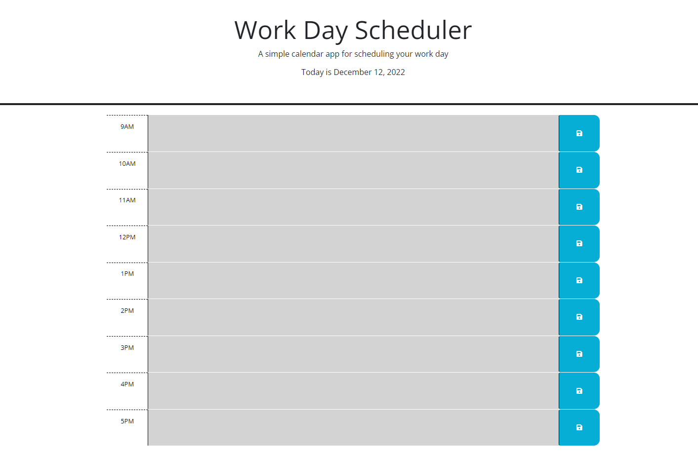

# Daily-Schedule
## Description

In this challenge I created the javascript code to allow a website to function as a daily scheduler, where a user can type text into a text area for each hour of the work day, and save the typed data into local storage so it remains upon leaving and returning or refreshing the page.  The page changes colors based on if the timeblock is in the past, present, or future, when compared to the current hour of the day.  The date is stored at the top of the web page for the current date.  This application could be used as a way for an employee to schedule out each part of their current day to ensure they get all work done they need to accomplish.

## Credits

I worked with a partner, Nick Rosales, for this project.  Here's a link to his github.

https://github.com/nickrosales/Work-Day-Scheduler

## Screenshot

## License

We were told we didn't need a license for this activity.

## Link to Deployed Webpage and Repository
https://mpacct.github.io/Daily-Schedule
https://github.com/Mpacct/Daily-Schedule/
